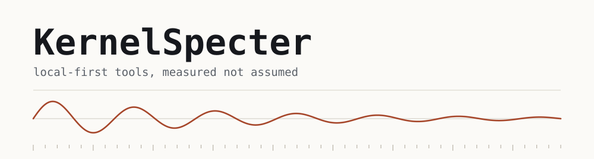

  <picture>
    <source media="(prefers-color-scheme: dark)" srcset="assets/header-dark.svg">
    <source media="(prefers-color-scheme: light)" srcset="assets/header-light.svg">
    
  </picture>

I build local-first tools. They run on your own machine, at a footprint you can
measure, and they don't phone home.

Mostly Rust and Python on a CPU-only laptop, which turns out to be a useful
constraint. It forces you to find out what things actually cost instead of assuming
the hardware will cover for you.

Rust, Python, TypeScript, JavaScript. Win32 and Linux IPC, DSP, browser
extensions. Everything here runs offline unless the whole point of it is a network.

## Projects

<table>
<tr>
<td width="50%">

</td>
<td width="50%">

</td>
</tr>
<tr>
<td width="50%">

</td>
<td width="50%">

</td>
</tr>
<tr>
<td width="50%">

</td>
<td width="50%">

</td>
</tr>
</table>

**[hidforge](https://github.com/KernelSpecter/hidforge)** holds an exact click rate
from 10 to roughly 10,000 per second and idles at 0% CPU. It learns whatever a button
actually emits rather than assuming a button number, because side buttons don't
arrive on a predictable channel and some never reach the OS at all.

**[AirLock](https://github.com/KernelSpecter/AirLock)** strips API keys, passwords
and PII out of text before it reaches an LLM. A CLI you can pipe or hang off a
pre-commit hook, plus a
[browser extension](https://github.com/KernelSpecter/AirLock-extension) that catches
the paste itself. Entirely local, no network calls, which is rather the whole point
of a tool for not leaking things.

**[quorum](https://github.com/KernelSpecter/quorum)** takes attendance from a signed
token the room hears at 19 kHz, with no GPS, no camera and no box on the wall. It
does not claim to stop one student carrying five friends' phones, because no audio
scheme ever has. It claims to notice: the same devices in the same room every day for
three weeks is a signature, and that goes in a report.

**[fretwork](https://kernelspecter.github.io/fretwork/)** is a playable guitar in a
single HTML file. Six coupled digital waveguides in an AudioWorklet, no recorded
samples anywhere. It opens in a browser, so it is the quickest thing here to try.

**[nowwatching](https://github.com/KernelSpecter/nowwatching)** puts whatever you are
watching on your Discord profile: the show's own name, poster art and a live
countdown. It reads the Windows media session, so there is nothing to enable per site.
Discord animates a card's progress bar client-side and has no field that means
stopped, so a paused bar cannot be frozen. It can only be put back where it belongs,
which it now is every ten seconds.
[anicli-rpc](https://github.com/KernelSpecter/anicli-rpc) does the same job for anime
in a terminal, by sitting between ani-cli and mpv without patching either one.

**[AutoDelete](https://github.com/KernelSpecter/AutoDelete)** puts a timer on the
messages you send in Discord, per channel, per category or per server, with a live
countdown and a keep button. Deleting is paced one message at a time and the timer
only ever runs late, never early, because the failure everyone else ships is a burst
of deletions that looks exactly like a bot.

**[Alife](https://github.com/KernelSpecter/Alife)** grows micro-organisms that learn
to survive within their own lifetime, with no generational hand-waving, on a single
CPU core. **[mochi](https://github.com/KernelSpecter/mochi)** is a cat that lives on
your desktop, watches you work, and expects to be fed.
**[Cadence](https://github.com/KernelSpecter/Cadence)** is a to-do app built around
the more interesting question: why you stop opening to-do apps.

## Everything here

| Repo | Written in | What it is |
| --- | --- | --- |
| [hidforge](https://github.com/KernelSpecter/hidforge) | Rust | Device-agnostic Windows macro engine. Learns what a button emits, replays with real timing |
| [AirLock](https://github.com/KernelSpecter/AirLock) | Python | Local-first CLI that redacts secrets and PII out of any text before you paste it |
| [AirLock-extension](https://github.com/KernelSpecter/AirLock-extension) | JavaScript | The same rules in the browser, catching the paste into an AI chat as it happens |
| [quorum](https://github.com/KernelSpecter/quorum) | HTML, DSP | Attendance from a signed ultrasonic token, with no location, camera or hardware |
| [fretwork](https://github.com/KernelSpecter/fretwork) | HTML, Web Audio | A playable guitar in one file. Six coupled waveguides, no samples. [Try it](https://kernelspecter.github.io/fretwork/) |
| [nowwatching](https://github.com/KernelSpecter/nowwatching) | Python | Discord Rich Presence for anything playing on the machine. No API key |
| [anicli-rpc](https://github.com/KernelSpecter/anicli-rpc) | Python | Discord Rich Presence for ani-cli. Title, episode, sub or dub, countdown, cover art |
| [AutoDelete](https://github.com/KernelSpecter/AutoDelete) | TypeScript | Vencord plugin that gives the messages you send a timer, with a keep button |
| [Alife](https://github.com/KernelSpecter/Alife) | Python | Micro-organisms that learn to survive inside one lifetime, on one CPU core |
| [mochi](https://github.com/KernelSpecter/mochi) | Python | A cat that lives on your desktop and expects to be fed |
| [Cadence](https://github.com/KernelSpecter/Cadence) | Android | A to-do list app you would actually come back to |
| [skribbl-oracle](https://github.com/KernelSpecter/skribbl-oracle) | JavaScript | Word helper, chat typeahead and crowd-reading ranker for skribbl.io |
| [autoclicker](https://github.com/KernelSpecter/autoclicker) | AutoHotkey | 53 clicks per second, not adjustable |
| [python-school-work](https://github.com/KernelSpecter/python-school-work) | Python | Coursework, kept in one place |
| [quest](https://github.com/KernelSpecter/quest) | JavaScript | |
| [WordDash-discord-bot-local-deployment-](https://github.com/KernelSpecter/WordDash-discord-bot-local-deployment-) | Python | |
| [discod-bot-web-deployment](https://github.com/KernelSpecter/discod-bot-web-deployment) | Python | |

## Currently

Learning cybersecurity properly, rather than by tutorial.

Reading an unreasonable amount of Win32 documentation as a side effect of hidforge:
Raw Input, HID report descriptors, and exactly how much a `QueryPerformanceCounter`
spin loop costs you.

Local IPC, lately. Discord frames its messages with an 8-byte header, mpv speaks
line-delimited JSON, and underneath both it is named pipes on Windows or Unix sockets
on Linux, which are far less interchangeable than they look.

The Windows media session too, which hands you a title, a duration and a timeline for
anything playing on the machine, and then quietly stops updating that timeline the
moment the tab goes to the background. Two bugs traced back to reading that silence
as a pause.
