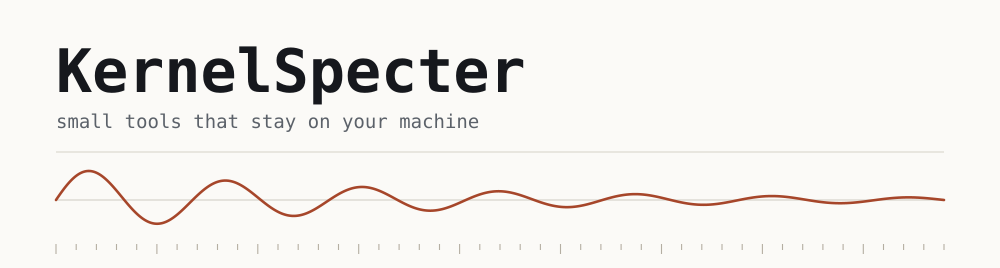

  <picture>
    <source media="(prefers-color-scheme: dark)" srcset="assets/header-dark.svg">
    <source media="(prefers-color-scheme: light)" srcset="assets/header-light.svg">
    
  </picture>

I build small tools. Most of them run on your own machine and don't talk to anybody.

I work off a laptop with no graphics card worth the name. Turns out that's a good
teacher. When you can't throw hardware at a problem, you have to go and find out what
the thing actually costs.

Rust, Python, TypeScript, JavaScript. Windows and Linux plumbing, sound, browser
extensions. If it doesn't need the network, it doesn't touch it.

## The ones I'd show you first

<table>
<tr>
<td width="50%">

</td>
<td width="50%">

</td>
</tr>
<tr>
<td width="50%">

</td>
<td width="50%">

</td>
</tr>
<tr>
<td width="50%">

</td>
<td width="50%">

</td>
</tr>
</table>

**[marquee](https://github.com/KernelSpecter/marquee)** — one word in a terminal and
the show plays. It finds the thing, opens mpv, remembers where you stopped, and tells
Discord and AniList about it.

The part I'd point at is how it's put together. What a show *is* comes from catalogs
that have been steady for years. Where to actually *get* it comes from scrapers, and
scrapers die. Keeping those two apart is what stops a dead scraper taking search down
with it. Adding a source is a file in a folder, not a change to the program.

**[hidforge](https://github.com/KernelSpecter/hidforge)** — holds a click rate from
ten a second up to near ten thousand, and sits at nothing when it's idle. It learns
what a button really sends instead of guessing at a number, because the side buttons
don't come in on a tidy channel and some never reach Windows at all.

**[AirLock](https://github.com/KernelSpecter/AirLock)** — takes the keys, passwords
and personal details out of your text before it reaches an AI. A CLI you can pipe
into or hang off a commit hook, and a
[browser extension](https://github.com/KernelSpecter/AirLock-extension) that catches
the paste itself. It never goes online, which is rather the point of a thing meant to
stop you leaking.

**[fretwork](https://kernelspecter.github.io/fretwork/)** — a guitar you can play, in
one HTML file. Six strings worked out as real waveguides, no recordings anywhere. It
opens in a browser, so it's the quickest thing here to try.

**[nowwatching](https://github.com/KernelSpecter/nowwatching)** — puts whatever
you're watching on your Discord profile. The show's name, the poster, a countdown. It
reads what Windows already knows, so there's nothing to set up site by site.

Discord draws that progress bar itself and has no way of saying *stopped*, so a
paused bar can't be frozen. It can only be put back where it belongs, which it is,
every ten seconds. [anicli-rpc](https://github.com/KernelSpecter/anicli-rpc) does the
same job for anime in a terminal, sitting between ani-cli and mpv without touching
either one.

**[AutoDelete](https://github.com/KernelSpecter/AutoDelete)** — puts a timer on the
messages you send in Discord. Per channel, per category, per server, with a countdown
and a keep button. It deletes one at a time, and it always runs late rather than
early. The failure everybody else ships is a burst of deleting that looks exactly
like a bot.

**[Alife](https://github.com/KernelSpecter/Alife)** — little organisms that learn to
stay alive inside their own lifetime. No breeding, no generations, one CPU core.
**[mochi](https://github.com/KernelSpecter/mochi)** is a cat that lives on your
desktop, watches you work, and expects feeding.
**[Cadence](https://github.com/KernelSpecter/Cadence)** is a to-do app built around
the better question — why you stop opening to-do apps.

## Everything here

| Repo | Written in | What it is |
| --- | --- | --- |
| [marquee](https://github.com/KernelSpecter/marquee) | Python | One command for anime and film. mpv, resume, Discord presence, AniList sync |
| [hidforge](https://github.com/KernelSpecter/hidforge) | Rust | Windows macro engine. Learns what a button sends, replays it with real timing |
| [AirLock](https://github.com/KernelSpecter/AirLock) | Python | Local CLI that takes secrets and personal details out of text before you paste it |
| [AirLock-extension](https://github.com/KernelSpecter/AirLock-extension) | JavaScript | The same rules in the browser, catching the paste into an AI chat as it happens |
| [fretwork](https://github.com/KernelSpecter/fretwork) | HTML, Web Audio | A guitar you can play, in one file. No recordings. [Try it](https://kernelspecter.github.io/fretwork/) |
| [nowwatching](https://github.com/KernelSpecter/nowwatching) | Python | Discord presence for anything playing on the machine. No API key |
| [anicli-rpc](https://github.com/KernelSpecter/anicli-rpc) | Python | Discord presence for ani-cli. Title, episode, sub or dub, countdown, cover art |
| [AutoDelete](https://github.com/KernelSpecter/AutoDelete) | TypeScript | Vencord plugin that gives the messages you send a timer, and a keep button |
| [Alife](https://github.com/KernelSpecter/Alife) | Python | Organisms that learn to stay alive inside one lifetime, on one CPU core |
| [mochi](https://github.com/KernelSpecter/mochi) | Python | A cat that lives on your desktop and expects feeding |
| [Cadence](https://github.com/KernelSpecter/Cadence) | Android | A to-do list you'd actually come back to |
| [autoclicker](https://github.com/KernelSpecter/autoclicker) | AutoHotkey | 53 clicks a second. Not adjustable |
| [python-school-work](https://github.com/KernelSpecter/python-school-work) | Python | Coursework, kept in one place |
| [WordDash-discord-bot-local-deployment-](https://github.com/KernelSpecter/WordDash-discord-bot-local-deployment-) | Python | |
| [discod-bot-web-deployment](https://github.com/KernelSpecter/discod-bot-web-deployment) | Python | |

## What I'm on lately

Learning security properly, rather than off tutorials.

Reading more Win32 documentation than any man ought to, on account of hidforge. Raw
Input, HID report descriptors, and what a `QueryPerformanceCounter` spin loop really
costs you.

Getting programs to talk to one another, mostly. Discord puts an 8-byte header on its
messages, mpv wants JSON a line at a time, and underneath both it's named pipes on
Windows or Unix sockets on Linux — which look a good deal more alike than they are.

And the Windows media session, which hands you a title, a length and a timeline for
anything playing, then quietly stops updating that timeline the moment the tab goes
to the background. Two bugs came back to me reading that silence as a pause.
